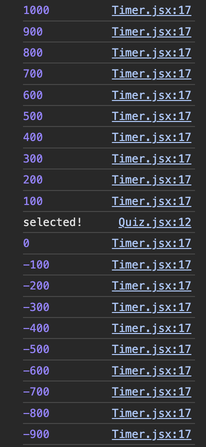

# Quiz-App-proj

퀴즈 앱 (ft. Udemy)

## 리액트에서 상태는

최소한으로 사용하는 것이 좋다.  
대신 적은 상태를 이용해 많은 값을 파생해 오는 것이 좋다.

\+ useEffect 도 최소한으로 사용해야한다.  
비교적 빠르게 진행되어서 잘못 사용하면 잠재적인 버그를 일으킬 수 있기 때문이다.

## 랜덤으로 섞기

```js
shuffledAnswers.sort(() => Math.random() - 0.5);
```

`Math.random() - 0.5` : -0.5와 0.5 사이의 난수를 반환한다.

- 반환 값이 0보다 작으면
  첫 번째 요소가 두 번째 요소보다 앞에 오고,
- 반환 값이 0보다 크면  
  두 번째 요소가 첫 번째 요소보다 앞에 온다.
- 반환 값이 0이면
  순서 유지

sort 메소드가 각 요소 쌍에 대해 이 비교 함수를 호출할 때마다, 무작위 값에 따라 배열의 요소들이 섞이게 된다.

## 타이머 만들기

### 불필요한 `setTimeout` 자동 실행 문제

```js
useEffect(() => {
  setTimeout(onTimeout, timeout);
}, [onTimeout, timeout]);
```

이렇게 했지만 timeout이 끝났는데도 해당 코드가 실행되어 문제가 생겼다.  
`timeout`은 지정된 시간 외로 변경될 문제가 전혀 없다.  
따라서 `onTimeout`이 문제라는 것이다.

- 이유

```js
<Timer timeout={15000} onTimeout={() => handleSelectAnswer(null)} />
```

JS에서 함수는`값`이자 `객체`이다.

그리고 JSX가 평가될 때 이렇게 함수가 생성되면, 생성되고 있는 메모리의 새로운 객체가 된다. 전과 완전히 똑같은 로직과 코드를 포함하더라도 메모리 내에서는 새로운 값으로 들어가는 것이다.

그래서 이 컴포넌트 내의 JSX 코드가 재평가 될 때마다 새로운 함수가 생성된다. 재평가는 이 Quiz 컴포넌트 안의 상태가 업데이트 될 때, 유저가 답을 고를 때마다 일어난다.

그래서 시간이 끝났는데도 재평가되는 과정이 생기면서 `<Timer>` 컴포넌트가 다시 실행된다.  
그러면 `setTimeout`도 다시 도는 것이다.

아래 사진을 보면 찍힌 숫자들은 `remainingTime` 중 일부, "selected!"는 `onTimeout`이 실행된 로그다.

타이머가 끝났는데 `<Quiz>`가 돌면서 다시 `<Timer>`도 다시 돌고 있다. 그런데 기존 `remainingTime`에 이어서 시간이 줄어드니까 progress 바는 다시 채워지지 않고 비어있는 것이다.

### `useCallback` 으로 해결하기

이를 이용해 의존성이 변경되어 필요하지 않는 한 함수가 재생성 되지 않도록 해야한다.

```js
const handleSelectAnswer = useCallback(function handleSelectAnswer(
  selectedAnswer
) {
  console.log("selected!");
  setUserAnswers((prev) => {
    return [...prev, selectedAnswer];
  });
},
[]);

const handleSkipAnswer = useCallback(
  () => handleSelectAnswer(null),
  [handleSelectAnswer]
);

/* 이하 생략 */
return(
  //...
  <Timer timeout={15000} onTimeout={handleSkipAnswer} />;
)
```

이렇게하면 `setTimeout`이 계속해서 실행되는 문제가 해결된다.

하지만 또 다른 문제.  
strict 모드로 인해 2번씩 실행이 되면서 시간이 2배로 줄어든다.  
이것을 해결하려면 한번 실행하고 다시 실행될 때 이전에 생성됐던 setInterval을 없애주어야 한다. 그래야 새로 생긴 하나만 남고 정상적으로 카운트다운이 된다.

### cleanup 함수로 해결하기

```js
useEffect(() => {
  const timer = setTimeout(onTimeout, timeout);
  return () => {
    clearTimeout(timer);
  };
}, [onTimeout, timeout]);

useEffect(() => {
  const interval = setInterval(() => {
    setRemainingTime((prev) => {
      return prev - 100;
    });

    return () => {
      clearInterval(interval);
    };
  }, 100);
}, []);
```

이렇게 재실행되면 원래 것은 사라지도록 해준다.

또 다른 문제는 문제가 넘어가도 진행바가 새로 채워지지 않는다는 것이다.

### `key` 속성 이용해서 `setInterval` 재실행 하기

> `key` 속성은 리액트 내장 속성이라 어떤 요소나 컴포넌트에도 넣을 수 있다.  
> \-----  
> 컴포넌트에서 키 속성이 변경될 때마다 리액트는 오래된 컴포넌트 인스턴스(instance)를 삭제하고 새로운 것을 만들어낸다.  
> 따라서 컴포넌트를 삭제하고 재생성하는 것이다.

문제가 넘어가면 `<Timer>`리 새롭게 생성되어야 초기화되면서 다시 시작될텐데, 새롭게 생성될 명분이 없는 상태라서 그렇다. 명분을 `key`속성을 추가해 만들어줄 수 있다.

```js
<Timer
  key={currentQuestionIndex}
  timeout={15000}
  onTimeout={handleSkipAnswer}
/>
```


## HTML

### \<progress> 태그

어느 작업의 완료 정도를 나타내며, 주로 진행 표시줄의 형태를 띈다.
